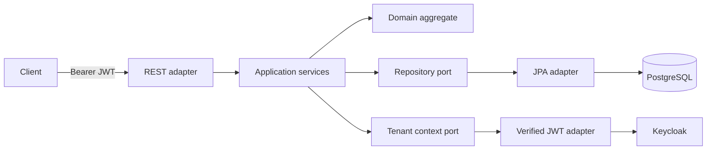

# TenantFlow

Secure multi-tenant work-order API built with Java 17, Spring Boot, PostgreSQL,
Keycloak and hexagonal architecture.

This personal portfolio project demonstrates tenant isolation, OAuth2/OIDC,
role-based authorization, optimistic locking, database migrations, observability
and integration testing. It is intentionally a modular monolith: services are
split only when scaling or ownership boundaries justify the operational cost.

## Architecture



## Security model

- `tenant_id` is read only from a cryptographically verified JWT.
- Every repository operation includes the tenant boundary.
- `WORK_ORDER_READ` and `WORK_ORDER_WRITE` roles protect use cases.
- API clients cannot submit or override a tenant identifier.
- Optimistic locking rejects lost updates.
- RFC 9457-style problem details provide predictable errors without leaking data.

The decisions and tradeoffs are documented in [`docs/adr`](docs/adr).

## Stack

- Java 17 and Spring Boot 3.5
- Spring Security OAuth2 Resource Server
- Keycloak 26.6
- PostgreSQL 17, Spring Data JPA and Flyway
- OpenAPI/Swagger UI
- Actuator and Prometheus metrics
- JUnit 5, Spring Security Test and Testcontainers
- Docker Compose and GitHub Actions

## Run locally

Requirements: JDK 17+, Docker and Docker Compose.

```bash
./gradlew clean build
docker compose up --build
```

Get a token for Acme's demo administrator:

```bash
curl -X POST http://localhost:8081/realms/tenantflow/protocol/openid-connect/token \
  -H 'Content-Type: application/x-www-form-urlencoded' \
  -d 'client_id=tenantflow-cli' \
  -d 'username=admin@acme.test' \
  -d 'password=demo123' \
  -d 'grant_type=password'
```

Use the returned `access_token`:

```bash
curl -X POST http://localhost:8080/api/v1/work-orders \
  -H "Authorization: Bearer $TOKEN" \
  -H 'Content-Type: application/json' \
  -d '{
    "title": "Investigate payment reconciliation alert",
    "description": "Mismatch detected in the nightly settlement",
    "priority": "HIGH",
    "assigneeEmail": "ops@acme.test"
  }'
```

Endpoints:

- `POST /api/v1/work-orders`
- `GET /api/v1/work-orders`
- `GET /api/v1/work-orders/{id}`
- `PATCH /api/v1/work-orders/{id}/status`
- Swagger UI: `http://localhost:8080/swagger-ui.html`
- Health: `http://localhost:8080/actuator/health`
- Metrics: `http://localhost:8080/actuator/prometheus`

## Test strategy

```bash
./gradlew test
```

- Pure domain tests cover allowed and forbidden state transitions.
- Application tests verify tenant isolation through ports.
- Testcontainers verifies the JPA adapter against real PostgreSQL.

## Production hardening still required

- PostgreSQL row-level security as defense in depth.
- Managed Keycloak or equivalent HA identity provider.
- TLS, secret manager integration and encrypted storage.
- Audit-event export, retention policy, rate limits and SLO-backed alerts.
- Pagination limits and workload-specific database tuning.

The list is explicit to keep the project technically honest.
